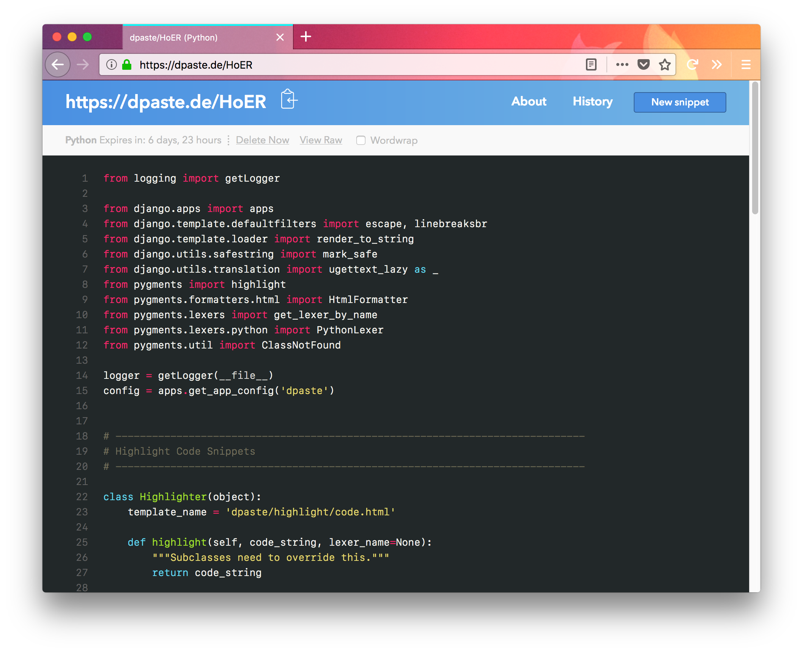

.. _index:

======
dpaste
======

.. image:: https://img.shields.io/pypi/v/dpaste.svg
    :target: https://pypi.org/project/dpaste/

.. image:: https://travis-ci.org/bartTC/dpaste.svg?branch=master
    :target: https://travis-ci.org/bartTC/dpaste

.. image:: https://api.codacy.com/project/badge/Coverage/185cfbe9b4b447e59a40f816c4a5ebf4
    :target: https://www.codacy.com/app/bartTC/dpaste

.. image:: https://api.codacy.com/project/badge/Grade/185cfbe9b4b447e59a40f816c4a5ebf4
    :target: https://www.codacy.com/app/bartTC/dpaste

dpaste is a pastebin_ application written in Python using the Django
framework. You can find a live installation on `dpaste.de`_.

The project is intended to run standalone as any regular Django Project,
but it's also possible to install it into an existing project as a typical
Django application.

The code is open source and available on Github:
https://github.com/bartTC/dpaste. If you found bugs, have problems or ideas with
the project or the website installation, please create an *Issue* there.

dpaste requires at a minimum **Python 3.4** and **Django 1.11**.

Documentation
=============

.. toctree::
   :maxdepth: 1

   standalone_installation
   project_installation
   management_commands
   settings
   api

.. _dpaste.de: https://dpaste.de/
.. _pastebin: https://en.wikipedia.org/wiki/Pastebin
